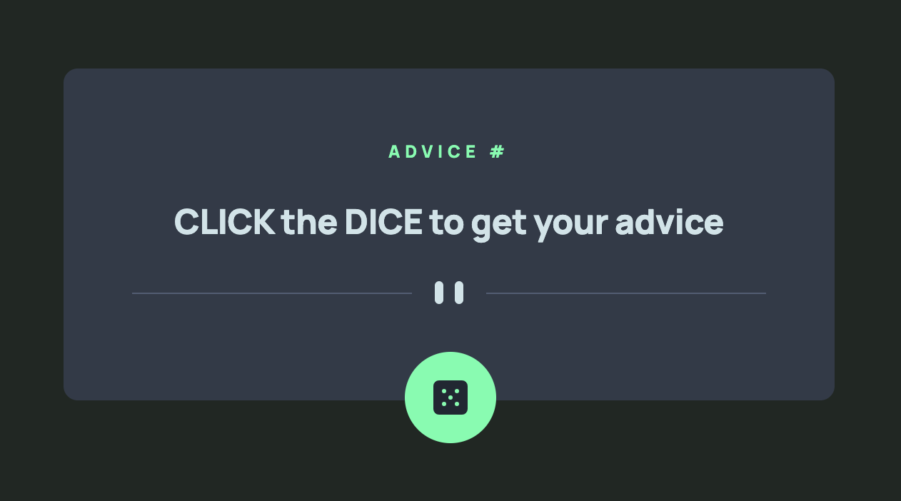
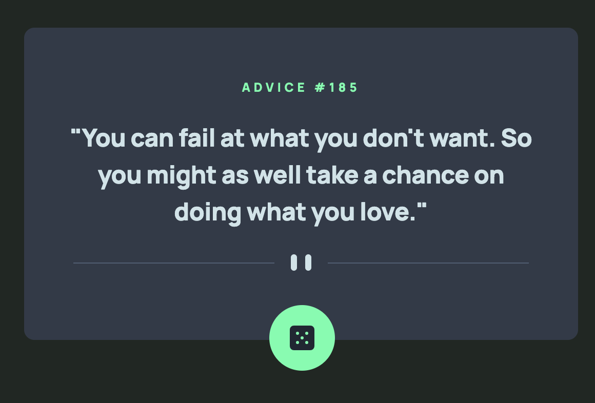
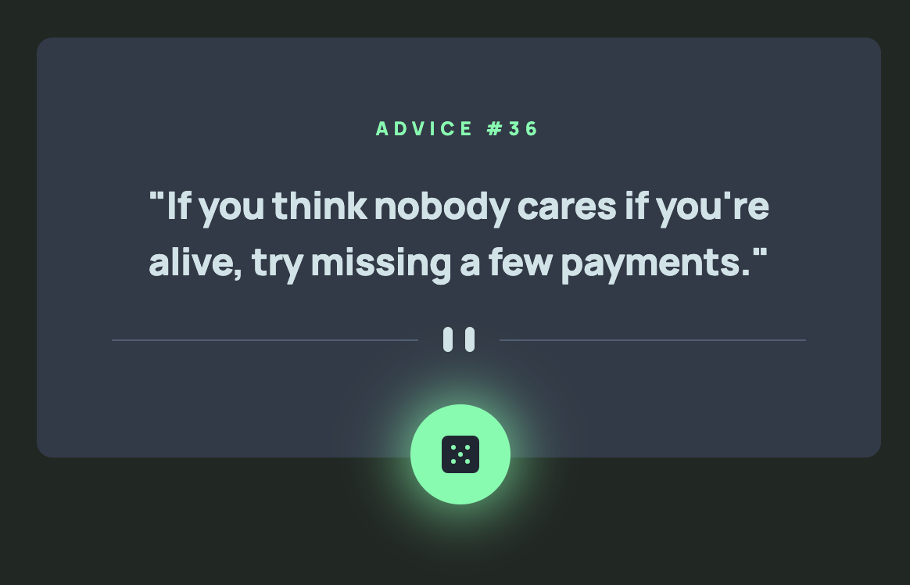

# Advice Generator App

This project is a responsive website, with optimal layout for mobile and desktop, using Fetch API to pull data from 3rd party API. Built with HTML, CSS and Javascript.

## Table of contents

- [Overview](#overview)
  - [The challenge](#the-challenge)
  - [Screenshot](#screenshot)
- [My process](#my-process)
  - [Built with](#built-with)
  - [What I learned](#what-i-learned)
  - [Useful resources](#useful-resources)
- [Acknowledgments](#acknowledgments)

## Overview

### The challenge

Users should be able to:

- View the optimal layout for the app depending on their device's screen size
- See hover states for all interactive elements on the page
- Generate a new piece of advice by clicking the dice icon

### Screenshot

Instruction to click



Display Advice



Dice Hover Effect



## My process

### Built with

- Semantic HTML5 markup
- CSS custom properties
- Flexbox
- Mobile-first workflow
- Javascript
- Fetch API
- Asynchronous Functions

### What I learned

This is my first time using Fetch API and Async function to pull data from 3rd party API. The solution is far from perfect, so any feedback or advice is highly welcomed!

First, I created a reusable fetchData function that returns the slip object.

```js
function fetchData(url) {
  return fetch(url)
          .then(response => response.json())
          .then(data => data.slip)
          .catch(error => console.error('Error when fetching: ', error))
}
```

Then, I created a function called PrintAdvice that take the slip object as parameter(data). After assign data.advice and data.id each to their variables, I used DOM to display them on the page.

```js
function printAdvice(data) {
  const advice = data.advice
  const adviceNum = data.id
  adviceContent.textContent = `"${advice}"`
  adviceNo.textContent = `ADVICE #${adviceNum}`
}
```

After that, in order to combine the FETCH and PRINT function to a single function, I created a async function called fetchAndPrint. This function will wait for the data to be fetched, and run the printAdvice function when the slip object is fetched and returned.

```js
async function fetchAndPrint() {
  try {
    const dataJSON = await fetchData('https://api.adviceslip.com/advice')
    printAdvice(dataJSON)
  } catch(error) {
    console.error ('Something is wrong :', error)
  }
}
```

Finally, I added a click event to the dice button, using fetchAndPrint as callback.

```js
diceBtn.addEventListener('click', fetchAndPrint)
```

Again, I'm really new to Fetch API and async function, so I'm not sure if I've done it right. If you find anything amiss, please don't hesitate to let me know!

### Useful resources

- [Using the Fetch API from MDN](https://developer.mozilla.org/en-US/docs/Web/API/Fetch_API/Using_Fetch#sending_a_request_with_credentials_included) 
- [Asynchronous JavaScript from MDN](https://developer.mozilla.org/en-US/docs/Learn/JavaScript/Asynchronous) 
- [Working with the Fetch API from Treehouse](https://teamtreehouse.com/library/working-with-the-fetch-api) 
- [Asynchronous Programming with Javascript from Treehouse](https://teamtreehouse.com/library/asynchronous-programming-with-javascript) 

## Acknowledgments

### Frontend Mentor - Advice generator app solution

This is a solution to the [Advice generator app challenge on Frontend Mentor](https://www.frontendmentor.io/challenges/advice-generator-app-QdUG-13db). 
